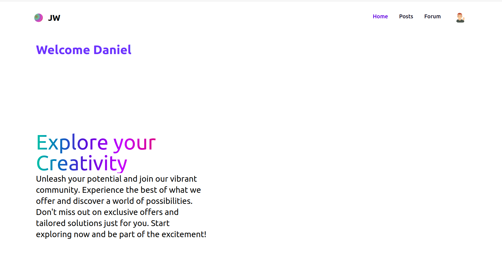

<!-- Improved compatibility of back to top link: See: https://github.com/othneildrew/Best-README-Template/pull/73 -->

<a name="readme-top"></a>

[![MIT License][license-shield]][license-url]

<!-- TABLE OF CONTENTS -->
<details>
  <summary>Table of Contents</summary>
  <ol>
    <li>
      <a href="#about-the-project">About The Project</a>
      <ul>
        <li><a href="#built-with">Built With</a></li>
      </ul>
    </li>
    <li>
      <a href="#getting-started">Getting Started</a>
      <ul>
        <li><a href="#prerequisites">Prerequisites</a></li>
        <li><a href="#installation">Installation</a></li>
      </ul>
    </li>
    <li><a href="#usage">Usage</a></li>
    <li><a href="#license">License</a></li>
    <li><a href="#contact">Contact</a></li>
    <li><a href="#acknowledgments">Acknowledgments</a></li>
  </ol>
</details>

<!-- ABOUT THE PROJECT -->

## About The Project



JW-Tracker offers a unique social media alternative, shifting focus from personal photos to movie and TV discussions. Engage in diverse topics, contemporary and nostalgic, with a passionate community. Explore the power of cinematic insights here!

<p align="right">(<a href="#readme-top">back to top</a>)</p>

### Built With

The major frameworks/libraries used to bootstrap this project.

- [![React][React.js]][React-url]
- [![Rails][Rails.com]][Rails-url]
- [![Tailwind][Tailwind.com]][Tailwind-url]

<p align="right">(<a href="#readme-top">back to top</a>)</p>

<!-- GETTING STARTED -->

## Getting Started

This is an example of how you may give instructions on setting up your project locally.
To get a local copy up and running follow these simple example steps.

### Prerequisites

This is an example of how to list things you need to use the software and how to install them.

- Install latest version of rails an node.js or check existing installations with

  ```sh
  rails -v
  node -v

  ```

### Installation

1. Clone the repo
   ```sh
   git clone git@github.com:danieljuma5/JW-Media-Tracker-App.git
   ```
2. Install required packages
   ```sh
   rails s
   rails db:migrate db:seed
   npm install --prefix client
   npm start --prefix client
   ```

<p align="right">(<a href="#readme-top">back to top</a>)</p>

<!-- USAGE EXAMPLES -->

## Usage

- Create, view, and comment on posts by other users.
- Delete posts and comments if you are the creator.
- The forum section is exclusive to members, requiring users to be logged in to comment on posts.
- Logging in is necessary to add posts in both the post and forum sections.
- Stay tuned for upcoming integration with the Trakt and TVDB APIs, enabling enhanced customization of user posts.

<p align="right">(<a href="#readme-top">back to top</a>)</p>

<!-- LICENSE -->

## License

Distributed under the MIT License. See `LICENSE.txt` for more information.

<p align="right">(<a href="#readme-top">back to top</a>)</p>

<!-- CONTACT -->

## Contact

Your Name - [Daniel Juma](https://github.com/danieljuma5) - jumadaniel275@gmail.com

Project Link: [https://github.com/danieljuma5/JW-Media-Tracker-App](https://github.com/danieljuma5/JW-Media-Tracker-App)

Deploy Link: [jw-show-tracker-app.onrender.com](jw-show-tracker-app.onrender.com)

<p align="right">(<a href="#readme-top">back to top</a>)</p>

<!-- ACKNOWLEDGMENTS -->

## Acknowledgments

Use this space to list resources you find helpful and would like to give credit to. I've included a few of my favorites to kick things off!

- [Choose an Open Source License](https://choosealicense.com)
- [Flowbite Tailwind Components](https://flowbite.com/docs/getting-started/introduction/)
- [Img Shields](https://shields.io)
- [Render Dashboard](https://dashboard.render.com/)
- [Font Awesome](https://fontawesome.com)
- [Figma](https://www.figma.com/)

<p align="right">(<a href="#readme-top">back to top</a>)</p>

<!-- MARKDOWN LINKS & IMAGES -->
<!-- https://www.markdownguide.org/basic-syntax/#reference-style-links -->

[license-url]: https://github.com/othneildrew/Best-README-Template/blob/master/LICENSE.txt
[linkedin-shield]: https://img.shields.io/badge/-LinkedIn-black.svg?style=for-the-badge&logo=linkedin&colorB=555
[linkedin-url]: https://linkedin.com/in/othneildrew
[React.js]: https://img.shields.io/badge/React-20232A?style=for-the-badge&logo=react&logoColor=61DAFB
[React-url]: https://reactjs.org/
[Rails.com]: https://img.shields.io/badge/rails-%23CC0000.svg?style=for-the-badge&logo=ruby-on-rails&logoColor=white
[Rails-url]: https://rubyonrails.org/
[Tailwind.com]: https://img.shields.io/badge/Tailwind-563D7C?style=for-the-badge&logo=bootstrap&logoColor=white

[Tailwind-url]: v1.tailwindcss.com]

```

```
